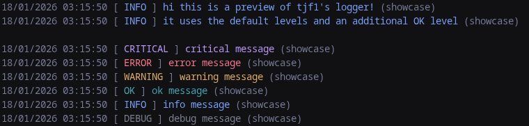
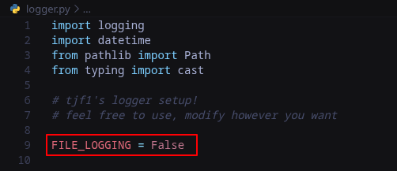

# tjf1's logger setup

simple python logger setup i use in most of my projects


## features

- easy to install and use
- clean, simple logs
- new "OK" level to indicate successful actions
- file logging

## install

make sure the cwd is the root of your project

### as submodule (recommended)

```bash
git submodule add https://github.com/tjf1dev/logger logger
git commit -m "add logger submodule"
```

### without submodule

```bash
git clone https://github.com/tjf1dev/logger
```

## usage

```py
import logger
logger.info("hello world!")
# > DD/MM/YYYY HH:MM:SS [ INFO ] hello world! (<module>)
```

## file logging

> [!WARNING]
> file logging is disabled by default!

the logger setup has file logging built in.  
it creates them to a `logs` folder  
with a `latest.log` and a log file for every session

to toggle file logging, open `logger/logger.py`  
and set `FILE_LOGGING` to `True` or `False`


